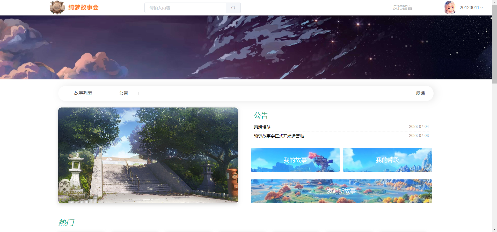

# FantasyDreamStoryClubJAVA

绮梦故事会网站——后端  
FantasyDreamStoryClub-绮梦故事会网站源码分享（故事接龙网站）  
**前端源码跳转：[https://github.com/1051727403/FantasyDreamStoryClubJAVA](https://github.com/1051727403/FantasyDreamStoryClubVUE)**
   
# 使用方式：  
本项目为springboot项目，项目成品可通过访问域名查看：www.qmstory.club   
项目启动前请修改application.yml文件来配置数据库、redis、端口图片存放地址等   
该项目为开源项目，欢迎大家提出修改意见或学习参考。   

## 数据库结构文件如下  
链接：https://pan.baidu.com/s/1eXt0lzsSPlnDfkKC2DHTDQ?pwd=6666   
提取码：6666  
  
## 注意  
该网站源码仅为个人学习测试使用，请在下载后24小时内删除，不得用于商业用途，否则后果自负。任何违规使用造成的法律后果与本人无关。  
  
## 更新日志

2023-6-28
-  ist转树形成功！评论区后端获取成功！

2023-6-30
- 添加删除片段功能实现

2023-7-1
- 修改片段完成，bug待改

2023-7-2
- 个人中心我的片段
- 评论区功能全部实现

2023-7-3
- 修复跳转bug，添加JWT接口 

项目展示  

